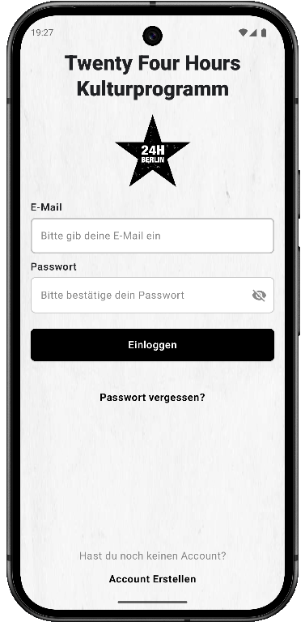
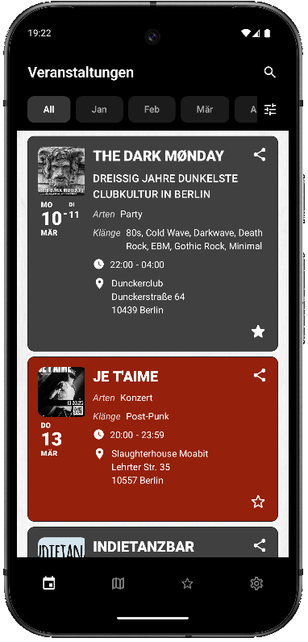

#  Twenty Four Hours Kulturprogramm - Emanuel Sutor

## App Description

This is an Android mobile app version of twenty-four-hours.info, an event calendar for subculture events in Berlin.

---

It serves to provide a more convenient and user friendlier mobile version of the website: scrollable event tab with search and filter functions, unfoldable extended detail view of the events withing the scrollable list by clicking the event, club map with overview of all events on a map
It provides all the features of the website plus the added functionality to favorite events to save them in a separate tab to keep track of events you want to attend and be notified before they happen.

---

Features:
- API based list of events with basic and expandable detail information
- External directions for navigation in Apple Maps
- Function to share and favorite events
- Various filters for events, club map and favorites
- Club Map with all events visualized and clickable map markers to open event info
- Push notification reminders for favorites
- Email and Password account creation with Firebase
- Data storing in Firestore
- Settings with account detail change option and ability to share app and delete account

---

<table>
  <tr>
    <td>
      
    </td>
    <td>
      
    </td>
  </tr>
</table>

